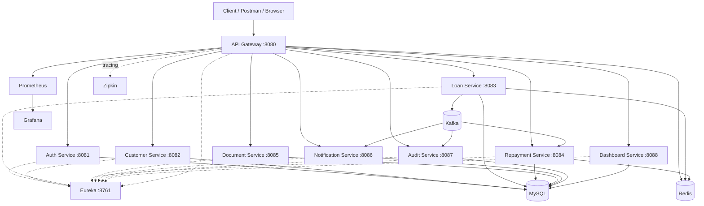

# Architecture

## Runtime layers

- **Edge:** API Gateway, JWT validation, routing, rate limiting and correlation IDs.
- **Business services:** auth, customer, loan, repayment and document.
- **Event-driven services:** notification and audit consume Kafka events; loan uses an outbox for reliable event publication.
- **Platform:** Eureka, MySQL, Redis, Kafka, Prometheus, Grafana and Zipkin.
- **Delivery:** GitHub Actions validates the repository; Jenkins builds, scans, publishes immutable images and deploys to Kubernetes.

## Kubernetes

The k8s directory contains namespace, configuration, service/deployment manifests, probes, resource limits, HPAs, PDBs, network policies and development-only infrastructure.
For production, replace development MySQL/Redis/Kafka workloads with managed services and provide secrets through the deployment environment.
